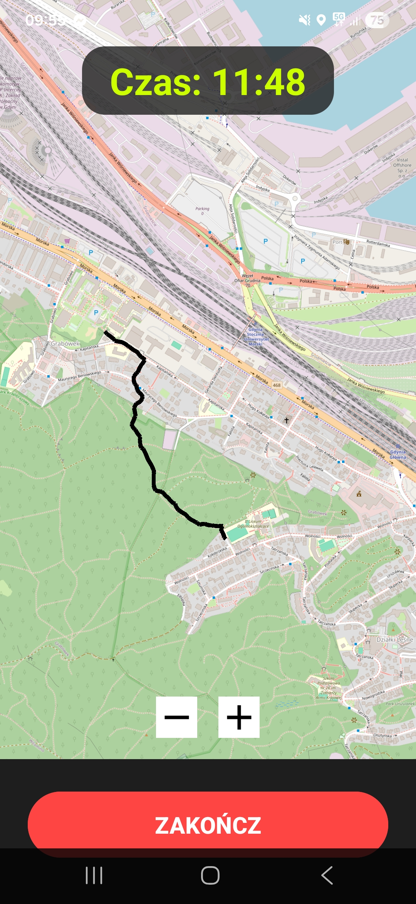
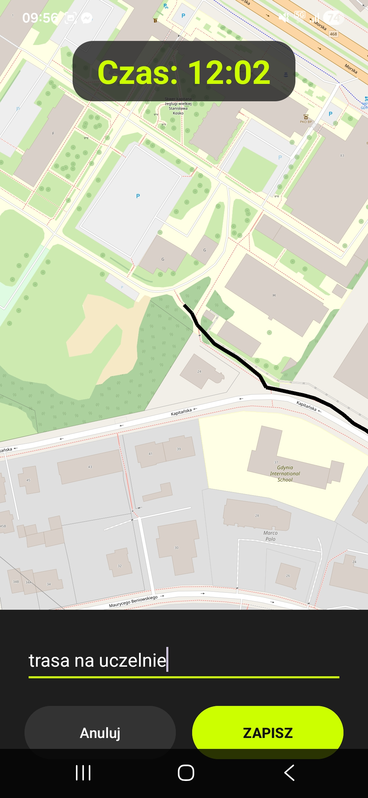
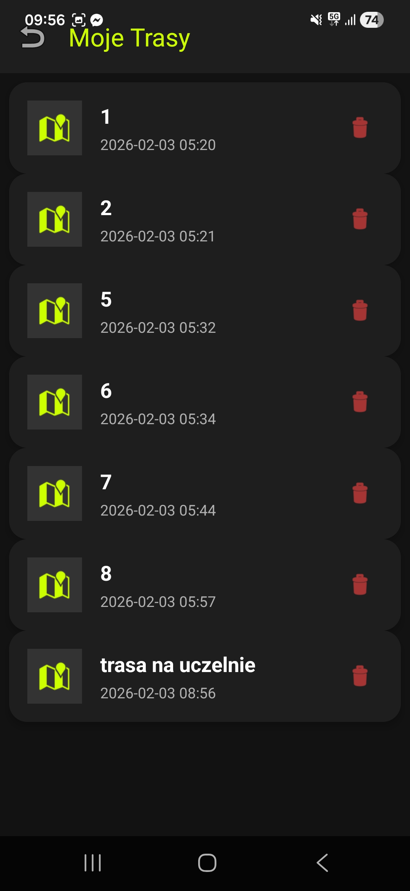
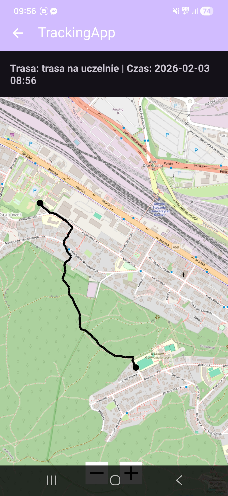

# 🏃‍♂️ TrackingApp (Cloud Edition)

**TrackingApp** to nowoczesna aplikacja mobilna na Androida służąca do rejestrowania tras biegowych GPS i archiwizowania ich w chmurze. Projekt wykorzystuje **InfluxDB** jako bazę danych szeregów czasowych oraz **OpenStreetMap** do wizualizacji, a całość zamknięta jest w energooszczędnym interfejsie **Dark Mode**.

---

## 📱 Funkcje

* ✅ **Live Tracking:** Śledzenie pozycji użytkownika w czasie rzeczywistym i rysowanie ścieżki na mapie.
* ✅ **Cloud Storage:** Automatyczny zapis tras do chmury **InfluxDB Cloud 2.0 (AWS)**.
* ✅ **Dark Mode UI:** Nowoczesny, ciemny interfejs z neonowymi akcentami, zaprojektowany z myślą o biegaczach.
* ✅ **Historia Treningów:** Pobieranie listy tras bezpośrednio z serwera wraz z podglądem daty i czasu.
* ✅ **Wizualizacja:** Szczegółowy podgląd przebytej trasy z automatycznym skalowaniem mapy (Bounding Box).
* ✅ **Error Handling:** Obsługa specyficznych błędów chmury (np. ograniczeń licencji Serverless).

---

## 📷 Zrzuty ekranu

| Ekran Główny | Zapis Trasy | Historia | Podgląd Mapy |
|:---:|:---:|:---:|:---:|
|  |  |  |  |

*(Aby zdjęcia działały: Utwórz w projekcie folder "screenshots" i wrzuć tam swoje zrzuty ekranu zmieniając ich nazwy na te powyżej)*

---

## 🗺️ Użyte technologie i biblioteki

* **Język:** Java (Android SDK min 26)
* **Mapa:** [osmdroid](https://github.com/osmdroid/osmdroid) – Open Source alternatywa dla Google Maps.
* **Baza danych:** [InfluxDB Java Client](https://github.com/influxdata/influxdb-client-java) – komunikacja z chmurą AWS.
* **Design:** XML Layouts, Material Design Components, Custom Styles.

---

## ⚙️ Wymagania i Konfiguracja

1.  Android 8.0 (API 26) lub nowszy.
2.  Dostęp do Internetu (wymagany do zapisu w chmurze i ładowania map).
3.  Konto w **InfluxDB Cloud** (lub własna instancja).

### Konfiguracja Bazy Danych
W pliku `AppConstants.java` należy podać własne dane uwierzytelniające:

```java
public class AppConstants {
    public static final String BASE_URL = "[https://eu-central-1-1.aws.cloud2.influxdata.com](https://eu-central-1-1.aws.cloud2.influxdata.com)";
    public static final String TOKEN = "TWOJ_TOKEN";
    public static final String ORG = "TWOJA_ORGANIZACJA";
    public static final String BUCKET = "TrackingApp";
}
